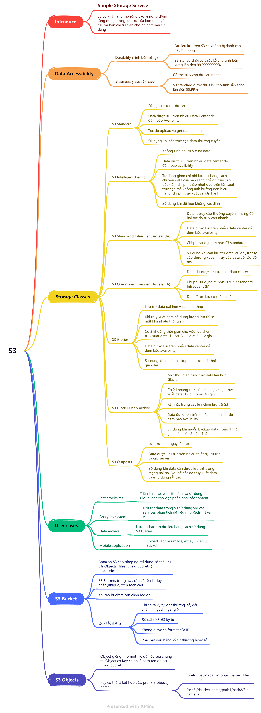

# IAM & S3

## IAM - Identity Access Management

### Thuật ngữ chính

- Root account: Là account đăng ký với AWS, có toàn quyền access tất cả resource trên AWS.
- Users: Là account được tạo ra bởi root account, chỉ được access các resource mà root account cho phép.
- Groups: Một nhóm các user, user có thể kế thừa các permission được gán cho group
- Policies:
  - Một JSON document, định nghĩa một set các permission.
  - Assign policy document cho User/Group/Role để định nghĩa permission cho các thực thể đó
- Roles:
  - Có thể tạo và assign role cho các resource trên AWS để định nghĩa permission cho các resource đó
  - VD: định nghĩa role full permission access S3 và gán role cho instance EC2 => instance EC2 có toàn quyền thao tác với S3

### Notes

- IAM là một global service (không apply cho một region cụ thể nào cả)
- User mới tạo không có permission
- User có 2 cách để access aws (có thể dùng 1 trong 2 hoặc cả , tùy vào admin set):
  - Programmatic access: dùng Access Key ID và Secret Access Key để access thông qua AWS API, CLI, SDK
  - AWS Management Console access: dùng username/password để login vào AWS Console
- Chỉ có thể nhận được Access Key ID và Secret Access Key một lần duy nhất khi tạo user. Nếu bị thất lạc key, dùng root account để generate cặp key mới.
- Enable Multifacter Authentication (MFA) trên root account: để login vào AWS Console, ngoài việc cung cấp email/password, cần cùng cấp thêm một mã code sinh tự động được thay đổi liên tục
- Có thể setup rule yêu cầu thay đổi password sau một khoảng thời gian nào đó, độ dài tối thiếu của password, ...

## S3 - Simple Storage Service

- Object-based storage
- Max file size: 5TB
- Unlimited storage
- File được lưu trong bucket
- Upload file thành công => trả về http code 200
- Bucket name là global và unique
- Normal url: https://.s3-.amazonaws.com
- Static website hosting url: http://.s3-website-.amazonaws.com
- Có thể enable **MFA Delete**

### Object-based storage

- File được lưu dưới dạng object, gồm các thông tin:
  - Key: tên object
  - Value: data của file (một chuỗi các byte)
  - Version ID: dùng cho versioning
  - Metadata: thông tin về data của file (người tạo, nguồn download file, ...)

### Data Consistency Model (Tính nhất quán dữ liệu)

- Read after write consistency for PUTS of new objects (Sau khi upload file mới, có thể đọc được ngay).
- Eventual consistency for overwrite PUTS and DELETES (Sau khi update hoặc xóa file, ngay sau đó đọc file có thể sẽ trả về version cũ).

### Guarantees

- Availability: 99.99%
- Durability: 99.999999999 (11 số 9)

### Charges

- Số lần request file
- Storage management Pricing
- Data transfer pricing
- Transfer Acceleration
- Sử dụng CloudFront để tăng tốc độ truyền tải file
- Cross region replication pricing

## Mindmap

